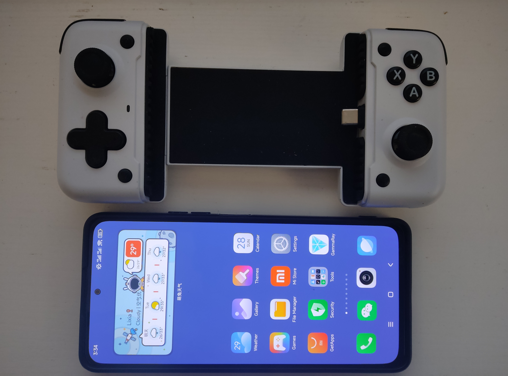
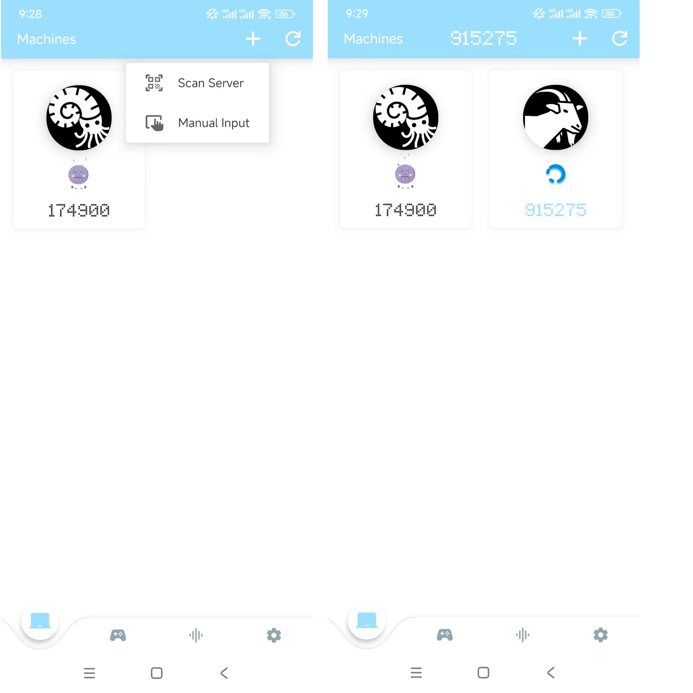
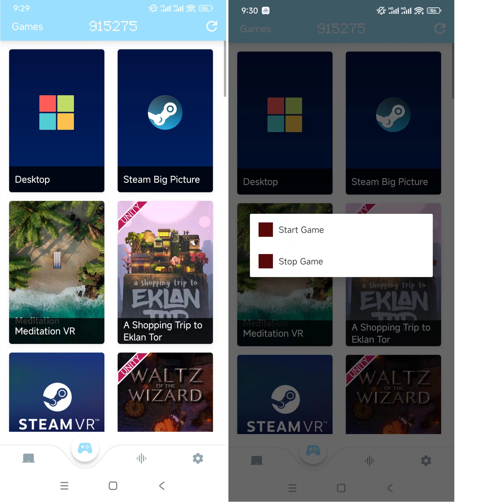
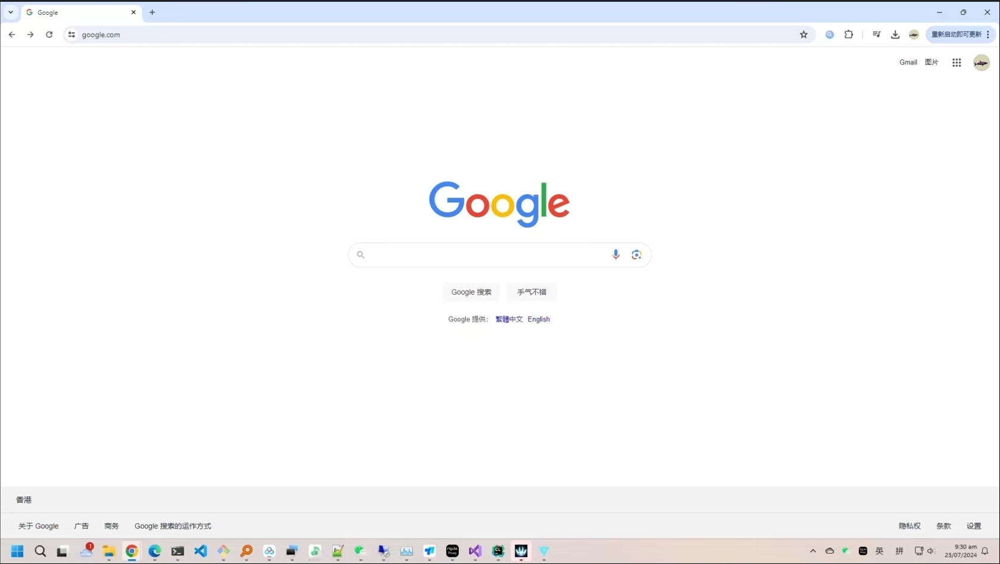
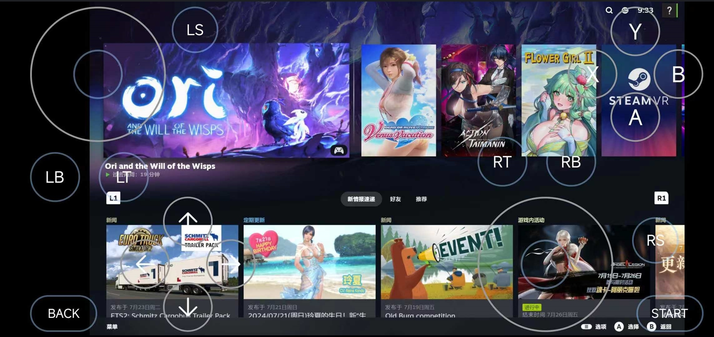
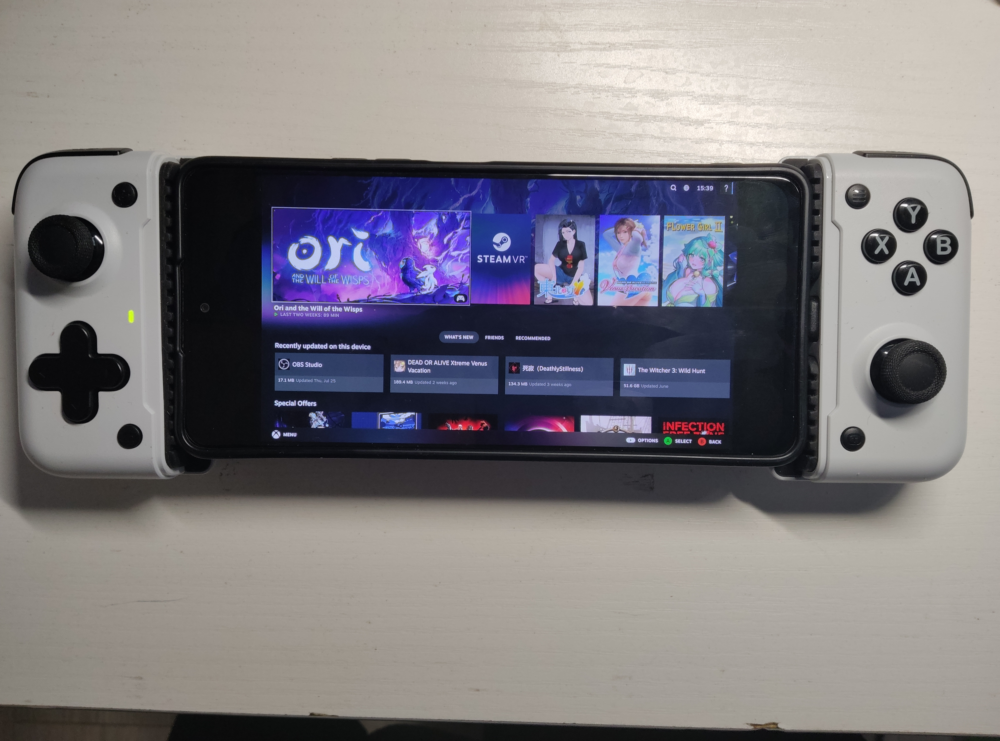
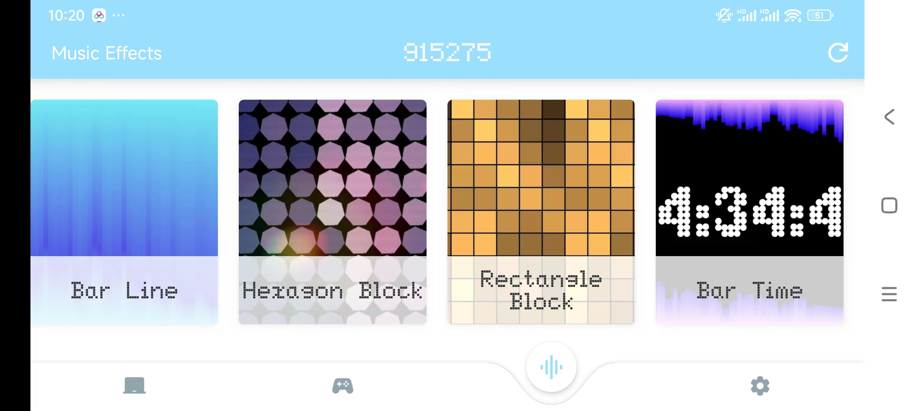
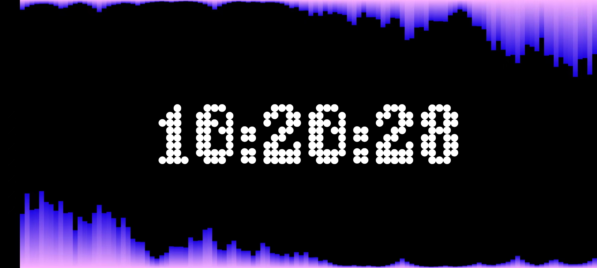

### GammaRay client for Android
#### !!! Please visit the repos !!!
**[Server](https://github.com/RGAA-Software/GammaRay)**  
**[PC Client](https://github.com/RGAA-Software/GammaRayPC)**

#### Support platforms
- arm64-android
- x64-android

#### Recordings
##### Test (Ori)

##### Test (Elden Ring)


#### 2 Run a Android Client
> Download and install the gammaray_official_xxx.apk first
##### 2.0 Prepare

##### 2.1 Scan the QR in server panel, it will connect automatically.


##### 2.2 Change to 2nd tab in the bottom, you'll see your games and 2 fixed options(Desktop, Steam Big Picture). Toch the Desktop(the first item).


##### 2.3 If it connected to the server, you'll see the frame that same as your server.


##### 2.4 If you touch the Steam Big Picture(the second item), your Server will run the steam in Big Piture Mode. You can turn Virtual Joystick on in settings tab(the 4th tab).



##### 2.5 If you just want to listen to the music that playing on your Server, you can switch to the 3rd tab, there are some buildin music spectrum effects, examples:




### How to Build
### Install dependences
#### 1. Change to VCPKG folder 
```c++
    cd {your-project-folder}/app/src/main/cpp/tc_3rdparty/vcpkg
```

#### 2. Install vcpkg.exe
```c++
    ./bootstrap-vcpkg.bat
```

#### 3. Install dependencies
```c++
    ./vcpkg.exe install sqlite3:arm64-android
    ./vcpkg.exe install ffmpeg[x264]:arm64-android
    ./vcpkg.exe install protobuf:arm64-android
    ./vcpkg.exe install glm:arm64-android
    
    and
    
    ./vcpkg.exe install sqlite3:x64-android
    ./vcpkg.exe install ffmpeg[x264]:x64-android
    ./vcpkg.exe install protobuf:x64-android
    ./vcpkg.exe install glm:x64-android
    
```